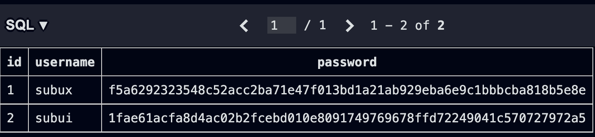

# Login System in Python

## Run
* python server.py (mac/ubuntu: python3 server.py)
* python client.py (mac/ubuntu: python3 server.py)

## Libraries:
* sqlite3 (f: database)
* hashlib (f: hash passwords)
* socket (f: server)
* threading (f: functions)

## Database

